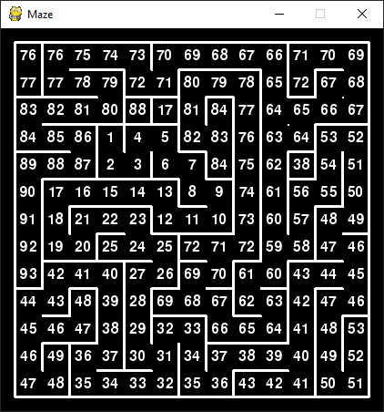

# Python Maze Generator
**Description:** This python program will generate a maze with my recursion algorithm. The PyGame library was used to display the maze. I created this algorithm to challenge myself, during my self quarantine from Covid-19.

## Algorithm Explained:
- The program will generate a 2D Array based on the desired # of rows and columns.
- Using a recursive function, the path begins to branch out in a possible direction.
- When the path hits a dead end, it will back track along the generated path until a spot with mutliple open directions is found.
- The maze will recursively extend until the array is full.

## Extra Information:
**Modify the code:** Use the [Trinket](https://trinket.io/pygame/6faa225a79) service to edit and remix the code live in the browser *(without setting up pygame)*

>*Set up Pygame to run the code locally:* [Add Pygame](https://stackoverflow.com/questions/28453854/add-pygame-module-in-pycharm-id)

*Note:* This program was started on 3/22/2020 7:54 PM and completed on 3/23/2020 at 6:38 PM. Revisied on 4/26/2020 at 10:00-12:00 AM.